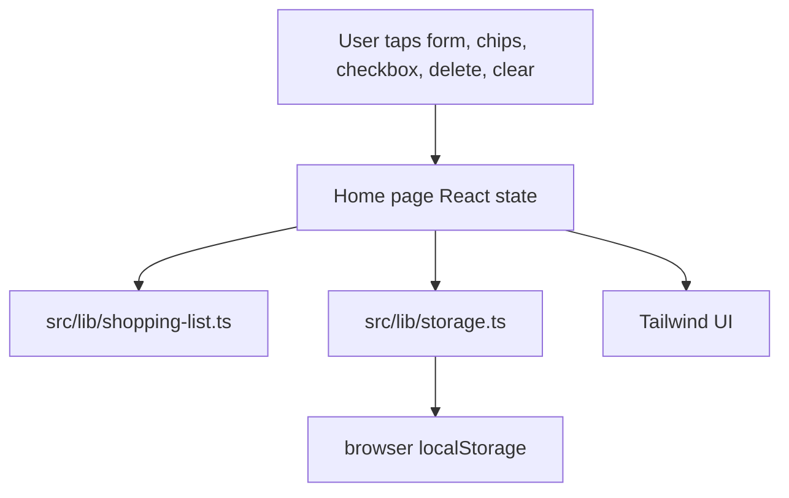

# Minha Lista MVP Design

**Spec**: `.specs/features/minha-lista-mvp/spec.md`
**Status**: Approved for initial implementation

---

## Architecture Overview

The MVP is a client-side Next.js App Router application. The UI lives in the home page and uses a reducer-like state flow through React hooks. Domain behavior is separated into pure TypeScript helpers for categorization, item creation, progress calculation, and storage parsing.



---

## Code Reuse Analysis

### Existing Components to Leverage

| Component | Location | How to Use |
| --- | --- | --- |
| None | Empty repository | Create project structure from scratch. |

### Integration Points

| System | Integration Method |
| --- | --- |
| Browser localStorage | `src/lib/storage.ts` serializes and validates the active list. |
| Future Vercel deployment | Standard Next.js build output via `npm run build`. |

---

## Components

### Home Page

- **Purpose**: Render the single active grocery list experience.
- **Location**: `src/app/page.tsx`
- **Interfaces**: React component using local state and handlers.
- **Dependencies**: `shopping-list`, `storage`, Tailwind CSS.
- **Reuses**: N/A.

### Domain Helpers

- **Purpose**: Provide framework-light logic for items, categories, progress, validation, and sample suggestions.
- **Location**: `src/lib/shopping-list.ts`
- **Interfaces**:
  - `createShoppingItem(input, now): ShoppingItem`
  - `inferCategory(name): ShoppingCategory`
  - `calculateProgress(items): ShoppingProgress`
  - `normalizeProductName(value): string`
- **Dependencies**: Type definitions from `src/lib/types.ts`.
- **Reuses**: N/A.

### Storage Helpers

- **Purpose**: Safely persist and restore the active list.
- **Location**: `src/lib/storage.ts`
- **Interfaces**:
  - `loadShoppingItems(storage): ShoppingItem[]`
  - `saveShoppingItems(storage, items): void`
- **Dependencies**: Type guards from `src/lib/types.ts`.
- **Reuses**: N/A.

---

## Data Models

```typescript
export type ShoppingCategory =
  | "Hortifruti"
  | "Carnes"
  | "Laticínios"
  | "Mercearia"
  | "Bebidas"
  | "Limpeza"
  | "Casa"
  | "Outros"

export interface ShoppingItem {
  id: string
  name: string
  quantity: string
  category: ShoppingCategory
  completed: boolean
  position: number
  createdAt: string
  updatedAt: string
}
```

---

## Error Handling Strategy

| Error Scenario | Handling | User Impact |
| --- | --- | --- |
| Empty product name | Reject submit and render inline validation. | List remains unchanged. |
| Invalid localStorage JSON | Return empty list and overwrite on next save. | App still opens. |
| localStorage unavailable | Catch save/load failures. | App remains usable for the session. |

---

## Risks & Concerns

| Concern | Location (file:line) | Impact | Mitigation |
| --- | --- | --- | --- |
| No existing test or quality guidelines | repository root | Test expectations could drift. | Add Vitest unit tests for all domain/storage acceptance criteria and use build as UI/config gate. |
| localStorage is browser-only | `src/lib/storage.ts` | Next.js SSR can fail if storage is accessed during render. | Access storage only inside `useEffect` and pass storage into helper functions. |

---

## Tech Decisions

| Decision | Choice | Rationale |
| --- | --- | --- |
| Rendering model | Client component for the main screen | MVP needs immediate local interactions and localStorage. |
| Testing model | Vitest for domain/storage helpers, build gate for UI | Keeps coverage focused where behavior is precise while still validating Next.js compilation. |
| Icons | lucide-react | Provides familiar symbols for navigation and actions without proprietary assets. |
